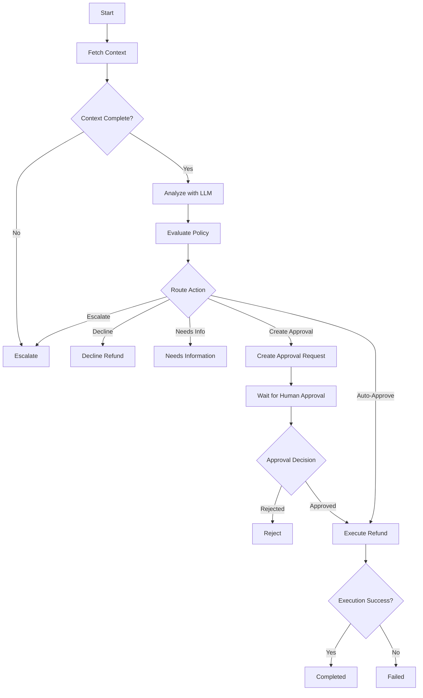

# Refund Approval System

## Project Overview

The Refund Approval System is a reliable, secure, and highly deterministic human-in-the-loop workflow engine for processing customer refund requests. By leveraging the advanced LangGraph framework, the system blends intelligent LLM analysis with a strict, code-based policy engine to ensure customer support operations can scale safely without compromising on compliance or financial security.

## Problem Statement

Automating financial transactions via LLMs introduces severe safety and security risks. LLMs can hallucinate context, be manipulated via prompt injection, or make unreliable decisions in complex scenarios. The core problem is scaling refund operations via AI while guaranteeing that the AI cannot independently authorize large or risky transactions, bypass security rules, or process fraudulent requests. 

This project solves that by confining the LLM to a strictly advisory and context-gathering role. A deterministic rules engine acts as the absolute authority, dictating if a refund auto-approves, requires human intervention (Reviewer/Manager), or must be declined outright. 

## Architecture

The system is designed as a state machine using LangGraph. The graph dictates the flow of execution, state persistence guarantees durability, and a mock payment processor acts as the sink.



## Folder Structure

```
refund_approval_system/
├── src/
│   └── refund_approval_system/
│       ├── agent/
│       │   ├── graph.py       # LangGraph topology and state machine definition
│       │   ├── llm.py         # LLM interaction and prompt handling
│       │   ├── nodes.py       # Graph node implementations
│       │   ├── state.py       # WorkflowState definition
│       │   └── tools.py       # External dependency integrations (Order DB, Customer DB)
│       ├── api.py             # FastAPI entrypoints for system interaction
│       ├── database.py        # SQLite database connection and initialization
│       ├── mock_tools.py      # Stubs simulating external API calls
│       ├── models.py          # Pydantic data models
│       ├── policy.py          # Deterministic rules engine
│       └── repository.py      # SQLite data access layer
├── tests/                     # Comprehensive Pytest suite
│   ├── test_acceptance.py     # End-to-end acceptance tests
│   ├── test_api.py            
│   ├── test_workflow.py       # State machine transitions
│   └── ...
├── .env.example
├── pytest.ini
└── README.md
```

## Technology Choices

* **Language:** Python 3.10+
* **Workflow Engine:** LangGraph (for stateful, checkpointed agent workflows)
* **Web Framework:** FastAPI (for highly performant REST APIs)
* **Data Validation:** Pydantic (for rigid state typing and LLM structured output)
* **Testing:** Pytest (for exhaustive deterministic test coverage)
* **Persistence:** SQLite (for zero-setup, durable audit logs and state checkpointing)

## Setup

1. **Install Dependencies:**
   The project uses `uv` for dependency management.
   ```bash
   uv sync
   ```
2. **Activate Virtual Environment:**
   ```bash
   source .venv/bin/activate  # On Windows: .venv\Scripts\activate
   ```

## Environment Variables

Copy `.env.example` to `.env` and configure:
```ini
OPENAI_API_KEY=your_openai_api_key
DB_PATH=refunds.db
```

## Running the API

Start the FastAPI server:
```bash
uv run uvicorn refund_approval_system.api:app --reload
```

## API Endpoints

* `POST /refunds` - Submit a new refund request.
* `GET /refunds/{refund_id}` - Check the status of a refund.
* `POST /approvals/{approval_id}/process` - Process a pending human approval.

## Example Requests

**Submit a refund request:**
```bash
curl -X POST http://localhost:8000/refunds \
  -H "Content-Type: application/json" \
  -d '{
    "refund_id": "REF-123",
    "customer_id": "CUS-001",
    "order_id": "ORD-1001",
    "amount": 45.0,
    "reason": "Item arrived damaged."
  }'
```

**Process an approval:**
```bash
curl -X POST http://localhost:8000/approvals/APR-XYZ/process \
  -H "Content-Type: application/json" \
  -d '{
    "decision": "approved",
    "reviewer_id": "REV-01",
    "reviewer_role": "reviewer",
    "refund_id": "REF-123",
    "order_id": "ORD-1001",
    "amount": 45.0
  }'
```

## Approval Workflow

1. **Auto-Approve:** Low-risk, low-value refunds (under $50) bypass human review and execute immediately.
2. **Reviewer Approval:** Mid-value ($50 - $500) or mildly risky refunds pause execution and generate an approval request requiring a `REVIEWER` role.
3. **Manager Approval:** High-value (over $500) or highly risky refunds pause execution and require a `MANAGER` role.
4. **Execution:** Once the human mathematically signs the approval matching the request exactly, the graph resumes and executes the payment.

## Policy Rules

The `policy.py` engine defines strict numeric rules for routing:
* **Amount < $50:** Auto-approved (if no risk flags exist).
* **Amount $50 - $500:** Requires `REVIEWER` approval.
* **Amount > $500:** Requires `MANAGER` approval.

## Risk Rules

* **Risk A (Repeated Refunds):** Customer has ≥3 refunds in the last 30 days. Forces at least `REVIEWER` approval.
* **Risk B (Mismatch):** The `customer_id` does not own the `order_id`. Immediately routes to `ESCALATED`.
* **Risk C (Missing Evidence):** Refund lacks required photographic evidence. Forces at least `REVIEWER` approval.
* **Risk D (Suspicious Activity):** Customer account flagged for fraud. Forces `MANAGER` approval.

## Failure Handling

1. **Tool/Dependency Failure:** External calls (e.g. `get_order_details`) retry automatically up to 3 times with exponential backoff. If failure persists, the workflow logs the error and safely `ESCALATES` rather than guessing missing context.
2. **Execution Failure:** If the payment gateway crashes during execution, the refund is explicitly flagged as `FAILED`. It is never falsely reported as `COMPLETED`.

## Security

* **Prompt Injection Defense:** The LLM's output (`RefundDecision`) only provides intent analysis. The deterministic policy engine intercepts any LLM hallucination or prompt injection bypass attempt.
* **Approval Tampering:** The system verifies the `amount`, `order_id`, and `refund_id` cryptographically bind to the pending approval. Expired approvals, mismatched roles, or modified amounts are rejected instantly.
* **Duplicate Execution:** A final check on the SQLite DB ensures a refund cannot be executed twice.

## Testing

The system boasts 160+ unit, integration, and acceptance tests. 
Run the entire suite via:
```bash
uv run pytest
```
